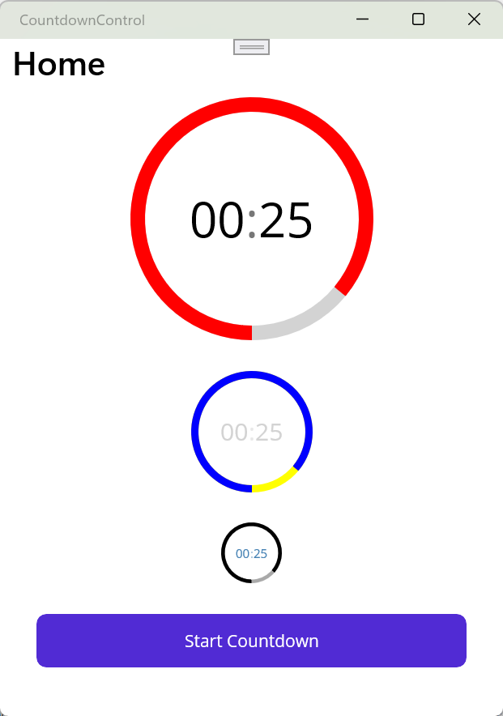

# ⏳ Animated Countdown Control in .NET MAUI


This repository showcases how to build a reusable and animated `CountdownControl` for your .NET MAUI applications. The control features a smooth radial progress ring, adaptive text, and cross-platform support — ideal for timers, productivity tools, games, and more.

> 🎉 This project is my contribution to [#MAUIUIJULY](https://x.com/hashtag/MAUIUIJuly), a community-driven event where .NET MAUI developers share UI-focused blog posts every day throughout July.  
> 📚 You can explore the full list of contributions on [this website](https://goforgoldman.com/posts/mauiuijuly-25/).

## 🚀 Getting Started

To try it out in your own MAUI app:

1. **Create a new .NET MAUI project** in Visual Studio or using the CLI.
2. **Add a new folder** called `Controls`.
3. Copy the implementation from this repo:
   - `CountdownDrawable.cs`: handles the radial animation logic.
   - `CountdownControl.xaml` and `CountdownControl.xaml.cs`: the visual control with bindable properties and animation logic.
4. Use the control in your XAML:

```xml
<controls:CountdownControl
    Duration="00:01:30"
    TextColor="White"
    ActiveColor="Green"
    InactiveColor="DarkGray" />
```

The control supports all major platforms: **Android**, **iOS**, **macOS Catalyst**, and **Windows**.

## 📂 File Overview

| File                          | Description                                      |
|-------------------------------|--------------------------------------------------|
| `CountdownDrawable.cs`        | Handles drawing the animated radial ring         |
| `MyAwesomeCountdownControl.xaml` | Defines the UI layout and bindings            |
| `MyAwesomeCountdownControl.xaml.cs` | Contains logic, animation loop, and bindings |

---

## ✅ Features

- 🔄 Smooth radial animation (~60 FPS)
- 🎨 Customizable colors (Active, Inactive, Text)
- 📏 Auto-scaling font size based on control size
- ✨ Blinking colon animation
- 🧩 Easy integration into existing MAUI apps
- 📱 Cross-platform support (Android, iOS, macOS Catalyst, Windows)

## 📸 Screenshots

Here’s how the `CountdownControl` looks on Windows:



It also works seamlessly on Android, iOS, and Mac Catalyst with native rendering and animations.

## 📝 Blog Post & Details

Want to learn more about the inner workings of the control, including how the radial arc is animated, how the blinking colon works, and how font scaling was implemented?

👉 Read the full post on [Medium](https://www.medium.com/@tsjdevapps):

- [⏳ Building an Animated Countdown Control in .NET MAUI](https://medium.com/@tsjdevapps/building-an-animated-countdown-control-in-net-maui-0b1faff7ed76)

## 📃 License

This project is licensed under the [MIT License](LICENSE).

## 💬 Feedback

Feel free to open an issue or drop me a message if you have feedback, questions, or want to collaborate!
